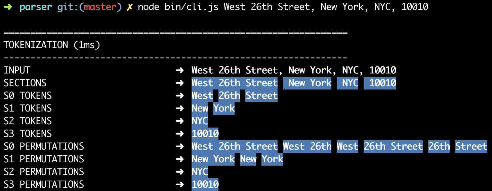

<p align="center">
  
</p>
<h3 align="center">A modular, open-source search engine for our world.</h3>
<p align="center">Pelias is a geocoder powered completely by open data, available freely to everyone.</p>
<p align="center">
<a href="https://en.wikipedia.org/wiki/MIT_License"></a>
<a href="https://hub.docker.com/u/pelias"></a>
<a href="https://gitter.im/pelias/pelias"></a>
</p>
<p align="center">
	<a href="https://github.com/pelias/docker">Local Installation</a> ·
        <a href="https://geocode.earth">Cloud Webservice</a> ·
	<a href="https://github.com/pelias/documentation">Documentation</a> ·
	<a href="https://gitter.im/pelias/pelias">Community Chat</a>
</p>
<details open>
<summary>What is Pelias?</summary>
<br />
Pelias is a search engine for places worldwide, powered by open data. It turns addresses and place names into geographic coordinates, and turns geographic coordinates into places and addresses. With Pelias, you’re able to turn your users’ place searches into actionable geodata and transform your geodata into real places.
<br /><br />
We think open data, open source, and open strategy win over proprietary solutions at any part of the stack and we want to ensure the services we offer are in line with that vision. We believe that an open geocoder improves over the long-term only if the community can incorporate truly representative local knowledge.
</details>

# Pelias Parser

A natural language classification engine for geocoding.

This library contains primitive 'building blocks' which can be composed together to produce a powerful and flexible natural language parser.

The project was designed and built to work with the [Pelias geocoder](https://github.com/pelias/pelias), so it comes bundled with a parser called `AddressParser` which can be included in other npm project independent of Pelias.

It is also possible to modify the configuration of `AddressParser`, the dictionaries or the semantics. You can also easily create a completely new parser to suit your own domain.

## AddressParser Example

```
30 w 26 st nyc 10010

(0.95) ➜ [
  { housenumber: '30' },
  { street: 'w 26 st' },
  { locality: 'nyc' },
  { postcode: '10010' }
]
```

## Application Interfaces

You can access the library via three different interfaces:
- all parts of the codebase are available in `javascript` via `npm`
- on the `command line` via the `node bin/cli.js` script
- through a `web service` via the `node server/http.js` script

> the web service provides an interactive demo at the URL `/parser/parse`

## Quick Start

A quick and easy way to get started with the library is to use the command-line interface:

```
node bin/cli.js West 26th Street, New York, NYC, 10010
```



---

# Architecture Description

Please refer to the CLI screenshot above for a visual reference.

## Tokenization

Tokenization is the process of splitting text into individual words.

The splitting process used by the engine maintains token positions, so it's able to 'remember' where each character was in the original input text.

> Tokenization is coloured `blue` on the command-line.

### Span

The most primitive element is called a `span`, this is essentially just a single string of text with some metadata attached.

The terms `word`, `phrase` and `section` (explained below) are all just ways of using a `span`.

### Section Boundaries

Some parsers like [libpostal](https://github.com/openvenues/libpostal) ignore characters such as `comma`, `tab`, `newline` and `quote`.

While it's unrealistic to expect commas always being present, it's very useful to record their positions when they are.

These boundary positions help to avoid parsing errors for queries such as `Main St, East Village` being parsed as `Main St East` in `Village`.

Once sections are established there is no 'bleeding' of information between sections, avoiding the issue above.

### Word Splitting

Each section is then split in to individual `words`, by default this simply considers whitespace as a word boundary.

As per the `section`, the original token positions are maintained.

### Phrase Generation

May terms such as 'New York City' span multiple words, these multi-word tokens are called `phrases`.

In order to be able to classify `phrase` terms, permutations of adjacent words are generated.

Phrase generation is performed per-section, so it will not generate a `phrase` which contains words from more than one `section`.

Phrase generation is controlled by a configuration which specifies things like the minimum & maximum amount of words allowed in a `phrase`.

### Token Graph

A graph is used to associate `word`, `phrase` and `section` elements to each other.

The graph is free-form, so it's easy to add a new relationship between terms in the future, as required.

Graph Example:

```javascript
// find the next word in this section
word.findOne('next')

// find all words in this phrase
phrase.findAll('child')
```

## Classification

Classification is the process of establishing that a `word` or `phrase` represents a 'concept' (such as a street name).

Classification can be based on:
- Dictionary matching (usually with normalization applied)
- Pattern matching (such as regular expressions)
- Composite matching (such as relative positioning)
- External API calls (such as calling other services)
- Other semantic matching techniques

> Classification is coloured `green` and `red` on the command-line.

### Classifier Types

The library comes with three generic classifiers which can be extended in order to create a new `classifier`:

- WordClassifier
- PhraseClassifier
- SectionClassifier

### Classifiers

The library comes bundled with a range of classifiers out-of-the box.

You can find them in the `/classifier` directory, dictionary-based classifiers usually store their data in the `/resources` directory.

Example of some of the included classifiers:

```javascript
// word classifiers
HouseNumberClassifier
PostcodeClassifier
StreetPrefixClassifier
StreetSuffixClassifier
CompoundStreetClassifier
DirectionalClassifier
OrdinalClassifier
StopWordClassifier

// phrase classifiers
IntersectionClassifier
PersonClassifier
GivenNameClassifier
SurnameClassifier
PersonalSuffixClassifier
PersonalTitleClassifier
ChainClassifier
PlaceClassifier
WhosOnFirstClassifier
```

## Solvers

Solving is the final process, where `solutions` are generated based on all the classifications that have been made.

Each parse can contain multiple `solutions`, each is provided with a `confidence` score and is displayed sorted from highest scoring solution to lowest scoring.

The core of this process is the `ExclusiveCartesianSolver` module.

This `solver` generates all the possible permutations of the different classifications while taking care to:
- ensure the same `span` position is not used more than once
- ensure that the same `classification` is not used more than once.

After the `ExclusiveCartesianSolver` has run there are additional solvers which can:
- filter the `solutions` to remove inconsistencies
- add new `solutions` to provide additional functionality (such as intersections)

### Solution Masks

It is possible to produce a simple `mask` for any generated solution, this is useful for comparing the `solution` to the original text:

```javascript
VVV VVVV NN SSSSSSS AAAAAA PPPPP
Foo Cafe 10 Main St London 10010 Earth      
```

# Contributing

Please fork and pull request against upstream master on a feature branch. Pretty please; provide unit tests.

## Unit tests

You can run the unit test suite using the command:

```bash
$ npm test
```


### Continuous Integration

CI tests every release against all supported Node.js versions.

### Versioning

We rely on semantic-release and Greenkeeper to maintain our module and dependency versions.

[](https://greenkeeper.io/)
